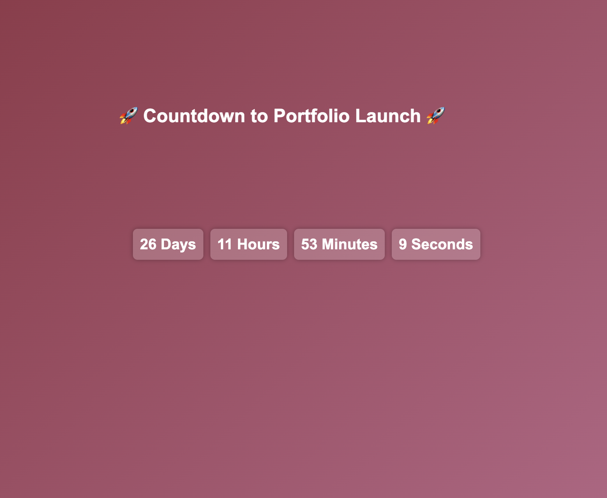

# 🎉 Day 12: Countdown to Portfolio Launch

This project is a **countdown timer** that ticks down to the **last day of the 30-day coding challenge**, when the **final portfolio showcasing all projects** will be launched. The page features a **beautiful gradient background, and a countdown timer.

## 🚀 Features
- ⏳ **Real-time countdown timer**
- 🎨 **Beautiful gradient background**
- 📱 **Responsive design** for all devices

---

## 🛠️ Technologies Used
- HTML
- CSS (with transitions for smooth effects)
- JavaScript (for toggling answers)

---

# Demo page

Click [Here](https://ayshasanyang.github.io/Day-12-Countdown-to-Portfolio-Launch/) to view the page

## 🚀 How to Run
1. Download or clone the repository
```bash
git clone https://github.com/ayshasanyang/Day-12-Countdown-to-Portfolio-Launch.git
```
2. Navigate to the project folder.
3. Open the project files in your vscode or any code editor of your choice
4. Open the `index.html` file in your web browser.

---


## 🎯 How It Works
- The countdown timer updates every second.
- The event date is set to **the last day of the coding challenge**.
- When the time reaches **00:00:00**, the celebration effects activate.

## 🎨 Customization
Want to customize the countdown for another event?  
- Open the **JavaScript file** in `script.js`.
- Update the `countdownDate` variable to **your desired date**.

## 📸 Preview
 

---

Made with ❤️ by [AYSHA] 🚀
